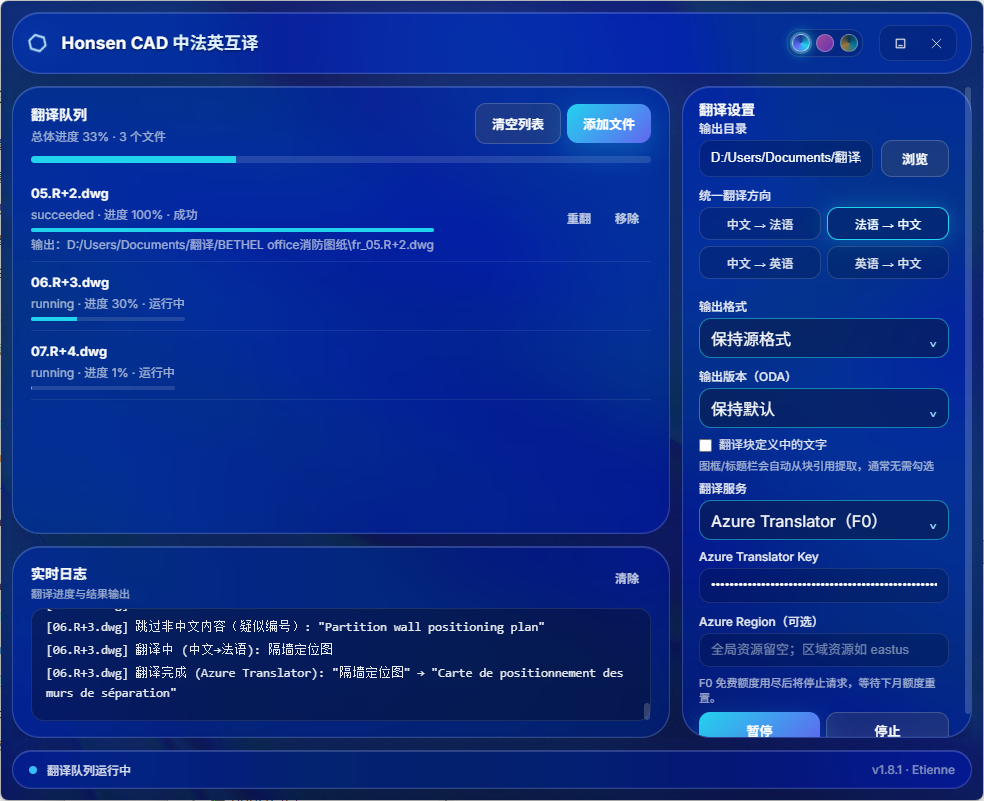

# Honsen CAD 中法英互译工具 v1.8.8

面向建筑、结构和机电图纸的 Windows/macOS 桌面翻译工具。它读取 CAD 图纸文字，使用 DeepL 或 Azure Translator F0 与工程术语表生成独立的译文图纸，支持单文件和可恢复的批量翻译队列。



## 功能

- 支持 `.dxf` 直接翻译；配置 [ODA File Converter](https://www.opendesign.com/guestfiles/oda_file_converter) 后支持 `.dwg`。
- 支持中文→法语、法语→中文、中文→英语、英语→中文；每一批队列使用一个统一翻译方向。
- 内置中法、法中、中英、英中 CAD 术语表。完整标签命中术语表时直接采用术语译文；其余文字交由所选翻译服务处理。
- 可选择 DeepL 或 Azure Translator F0。Azure F0 用尽月度免费额度时会显示额度已用尽并停止该任务，不会反复重试；可等待下月额度重置。
- 翻译 `TEXT`、`MTEXT`、`ATTDEF`、`ATTRIB` 与 `MULTILEADER` 文字；可选翻译块定义文字。
- 支持输出为源格式、DXF 或 DWG，并可选择 ODA 支持的输出版本（AutoCAD R9 至 2018）。输出文件按目标语言添加 `fr_`、`en_` 或 `zh_` 前缀，不覆盖源文件。

## 批量队列

- 直接添加多个 DXF/DWG 文件，按入队顺序调度，显示单文件和整体进度。
- 支持开始、暂停、继续、停止、清空队列、移除未运行项，以及对完成或失败项单独重翻。
- 自动重试可恢复的翻译失败；实时日志展示处理进度与错误摘要。
- 任务状态、进度、输出路径与重试次数保存在 `~/.cad_translator_queue.json`。异常退出后，未完成任务会恢复为待继续状态。
- 默认每个 DeepL API Key 最多并行 2 个文件、全局最多 3 个文件；DWG 的 ODA 转换串行执行，避免并发占用冲突。

## 使用

1. 启动程序，选择翻译服务并填写对应 API Key；Azure 区域资源还需填写 Region。再选择输出目录、统一翻译方向、输出格式和版本。
2. 点击“添加文件”选择一个或多个 DXF/DWG 文件；添加不会立即调用 ODA 或 DeepL。
3. 点击“开始翻译”。处理中可暂停或停止，失败项可单独重翻。
4. 在输出目录中查看带语言前缀的译文图纸，并在 CAD 软件中复核文字与版式。

DeepL/Azure Key 和默认输出目录仅保存在用户目录的 `~/.cad_translator_config.json`；首次使用时默认输出到 `~/Documents/Honsen CAD output`（macOS Finder 中显示为“文稿/Honsen CAD output”）。DeepL 也可通过环境变量 `DEEPL_API_KEY` 提供 Key。

## 环境要求

- Windows 10/11（桌面界面需要 WebView2；Windows 11 通常已内置），或 macOS 11 及以上。
- Python 3 与 Node.js（从源码运行或打包时需要）。
- 有效的 DeepL API Key 或 Azure Translator F0 Key。
- 仅处理 DXF 时不需要 ODA；处理 DWG 需安装或配置 ODA File Converter。

## 从源码运行

Windows PowerShell：

```powershell
pip install -r requirements.txt
cd frontend
npm install
npm run build
cd ..
python run.py
```

macOS：

```bash
python3 -m venv .venv
source .venv/bin/activate
pip install -r requirements-macos.txt
cd frontend && npm ci && npm run build && cd ..
python run.py
```

开发前端时，可分别启动本地 API 与 Vite：

```powershell
# 终端 1
python -c "import uvicorn; from backend.api import app; uvicorn.run(app, host='127.0.0.1', port=8765)"

# 终端 2
cd frontend
npm run dev
```

然后访问 `http://localhost:5173`。

## 项目结构

- `backend/`：翻译、CAD 转换、队列、FastAPI、本地语言资产、授权与存储逻辑。
- `desktop/`：pywebview 桌面窗口和原生文件/资源管理器操作。
- `tools/`：仅供开发者使用的授权发码工具。
- `tests/`：后端回归检查；可通过 `python -m tests.test_translation_modes` 等模块命令运行。
- `glossaries/`：随软件发布的中法、中英、法中、英中 CAD 内置术语表与修正规则。
- `run.py`：桌面程序与 PyInstaller 的唯一入口。

## DWG 与 ODA

程序按以下顺序查找 ODA File Converter：

1. 环境变量 `CAD_ODA_EXEC` 指定的完整路径；
2. Windows 程序同级的 `ODAFileConverter/ODAFileConverter.exe`；
3. macOS 主应用同级的 `ODAFileConverter.app/Contents/MacOS/ODAFileConverter`；
4. Windows：`C:\Program Files\ODA\ODAFileConverter\ODAFileConverter.exe`；
5. macOS：`/Applications/ODAFileConverter.app/Contents/MacOS/ODAFileConverter`，或 `PATH` 中的 `ODAFileConverter`。

未找到 ODA 时仍可翻译 DXF。DWG 会经过“DWG → 工作 DXF → 翻译 → 目标 DWG/DXF”的流程；请遵守 ODA 的许可条款。

## 打包 Windows 程序

```powershell
pip install pyinstaller
cd frontend
npm install
npm run build
cd ..
pyinstaller --clean --noconfirm Honsen_CAD_Translator_v1.8.8.spec
```

生成文件为 `dist/Honsen_CAD_Translator_v1.8.8.exe`。如需开箱支持 DWG，请将完整 ODA 目录放在 `dist/ODAFileConverter/`。

安装 Inno Setup 6 后可生成安装包：

```powershell
.\installer\build_installer.ps1
```

## 打包 macOS 应用

macOS 使用独立 spec，不会读取或改写 Windows 打包配置：

```bash
python3 -m venv .venv
source .venv/bin/activate
pip install -r requirements-macos.txt
cd frontend && npm ci && npm run build && cd ..
python installer/build_macos.py --oda-dmg /path/to/ODAFileConverter_macOS.dmg --dmg
```

生成单个 `dist/Honsen CAD Translator.app` 与可分发的 `dist/Honsen_CAD_Translator_v1.8.8_macOS_arm64.dmg`；官方 ODA DMG 会嵌入应用的 `Contents/Resources/ODAFileConverter.dmg`。程序需要 ODA 时将其只读挂载，直接调用官方签名的 `ODAFileConverter.app`，关闭时卸载。构建脚本会校验 DMG 签名、Gatekeeper 状态与架构，拒绝将 x86_64 ODA 搭配 arm64 主程序，反之亦然。

默认 `--identity -` 仅用于本机测试签名。发布时在对应架构的 macOS/Python 环境分别生成 Apple Silicon 和 Intel 版，并传入 `--identity "Developer ID Application: ..."`，然后对成品进行 Apple 公证。当前 Homebrew Python 只有 arm64 切片，不能在本机交叉产出真正的 Intel 主应用。

## 注意事项

- 翻译消耗 DeepL 配额；批量任务请避免同时使用同一 Key 运行多个程序。
- 术语表优先保证标准图纸标签的一致性；长句和存在歧义的缩写仍应在输出图纸中复核。
- 工具始终写入新文件，不会直接覆盖源图纸；复杂或重要图纸仍建议先备份并进行 CAD 打开验证。
